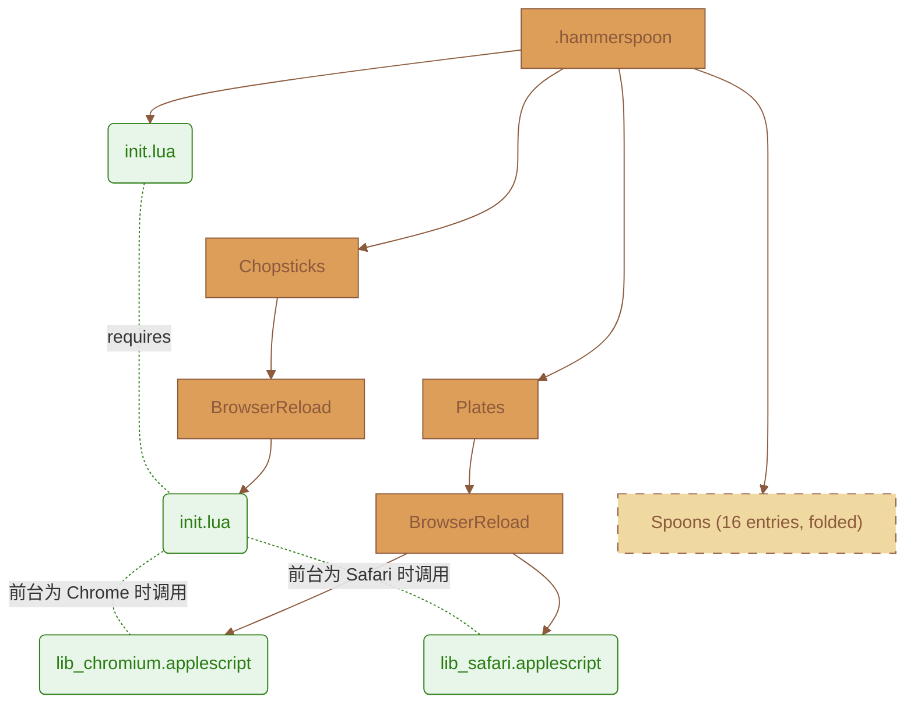

# .hammerspoon

## 摘要

`Chopsticks` is built on [Hammerspoon](https://www.hammerspoon.org/) and [Spoons](https://github.com/Hammerspoon/Spoons), utilizing [Lua](https://www.lua.org/) and [AppleScript](https://developer.apple.com/library/archive/documentation/AppleScript/Conceptual/AppleScriptLangGuide/introduction/ASLR_intro.html) to design an extension framework suitable for local secondary development.

- BrowserReload **_拓展模块_**
  - 作为一问多答同屏共版 AI 多家平台页面, 所配套的工具箱之一, 可自定义标签页面同步数据, 以加载其他端点的实时信息
- EmmyLua
  - Thie plugin generates EmmyLua annotations for Hammerspoon and any installed Spoons
- Commander
  - This spoon lets execute commands from other spoon by a chooser
- HSKeybindings
  - Display Keybindings registered with bindHotkeys() and Spoons
- KSheet
  - Keybindings cheatsheet for current application
- MouseCircle
  - Draws a circle around the mouse pointer when a hotkey is pressed
- MouseFollowsFocus
  - Set the mouse pointer to the center of the focused window whenever focus changes
- InputSourceSwitch
  - Automatically switch the input source when switching applications
- ReloadConfiguration
  - Adds a hotkey to reload the hammerspoon configuration, and a pathwatcher to automatically reload on changes
- Seal
  - Pluggable launch bar
- SpeedMenu
  - Menubar netspeed meter
- TextClipboardHistory
  - Keep a history of the clipboard, only for text entries
- WifiNotifier
  - Receive notifications every time your wifi network changes
- WiFiTransitions
  - Allow arbitrary actions when transitioning between SSIDs
- WindowHalfsAndThirds
  - Simple window movement and resizing, focusing on half- and third-of-screen sizes
- WindowScreenLeftAndRight
  - Move windows to other screens

## 目录结构

| 路径          | 说明                                                                           |
| ------------- | ------------------------------------------------------------------------------ |
| `init.lua`    | 入口文件: 配置环境, 绑定快捷键                                                 |
| `Chopsticks/` | **_拓展_**:`BrowserReload` 的 Lua 业务逻辑主体                                 |
| `Plates/`     | **_拓展_**:`BrowserReload` 使用的 AppleScript 模板 (按浏览器核心类型拆成 2 份) |
| `Spoons/`     | 自动下载, 管理所有第三方插件                                                   |

> [!NOTE]
>
> 参照 `Spoons` (勺子: 代码和数据/一体), 扩展模块命名为 `Chopsticks` (筷子: 代码/逻辑) 与 `Plates` (盘子: 数据/模板)

## 拓扑图



> [!NOTE]
>
> init.lua 持有配置与热键并通过 andUse() 注入插件: 配置、编排、原语三层各自可以独立迭代，互不知晓对方细节, 三层分离:
>
> - `init.lua` 入口: 绑定触发键 和 配置站点标签
> - `Chopsticks/BrowserReload/init.lua` 纯 Lua 层: 检测环境, 识别默认浏览器, 生成匹配条件, 调用 AppleScript, 渲染模板
> - `Plates/BrowserReload/lib_*.applescript` 纯 AppleScript 层: 按浏览器引擎类型拆成 Chromium / Safari 2 份, 与 Lua 层解耦

## 已启用的 快捷键 与 模块

| 快捷键                  | 功能                                 | 模块                     |
| ----------------------- | ------------------------------------ | ------------------------ |
| `⌃ ⌥ ⌘ + B`             | 批量刷新 AI 标签页面                 | BrowserReload            |
| `⌃ ⌥ ⌘ + '`             | 命令面板                             | Commander                |
| `⌃ ⌥ ⌘ + I / O`         | macOS 快捷键速查表 开关              | HSKeybindings            |
| `⌃ ⌥ ⌘ + P`             | Spoon 快捷键速查表 开关              | KSheet                   |
| `⌃ ⌥ ⌘ + M`             | 鼠标位置圈 激活                      | MouseCircle              |
| `⌃ ⌥ ⌘ + ;`             | Spotlight 式 应用 / 书签 启动器 开关 | Seal                     |
| `⌃ ⌥ ⌘ + U`             | 剪贴板历史 开关                      | TextClipboardHistory     |
| `⌃ ⌥ ⌘ + 7 / 9 / 3 / 1` | 左上 / 右上 / 右下 / 左下 四分之一屏 | WindowHalfsAndThirds     |
| `⌃ ⌥ ⌘ + A / W / D / S` | 左 / 上 / 右 / 下 三分之一屏         | WindowHalfsAndThirds     |
| `⌃ ⌥ ⌘ + 4 / 8 / 6 / 2` | 左 / 上 / 右 / 下 二分之一屏         | WindowHalfsAndThirds     |
| `⌃ ⌥ ⌘ + 5`             | 窗口居中                             | WindowHalfsAndThirds     |
| `⌃ ⌥ ⌘ + 0`             | 撤销窗口操作                         | WindowHalfsAndThirds     |
| `⌃ ⌥ ⌘ + ↑ / ↓`         | 窗口渐大 / 渐小                      | WindowHalfsAndThirds     |
| `⌃ ⌥ ⌘ + ← / →`         | 最大化开关 / 最大化激活              | WindowHalfsAndThirds     |
| `⌃ ⌥ ⌘ + [ / ]`         | 移动窗口跨 左 / 右 屏                | WindowScreenLeftAndRight |

## BrowserReload 的配置方式

### 设计思想

- `sites` 是 "域名 =? 是否启用" 的映射
- `CHROMIUM_BROWSERS` 是 "浏览器 =? 是否启用" 的映射
- 而非直接增删数组条目, 若想临时停用某个站点或某个浏览器, 改一下布尔值就行, 不用删代码, 也保留了 "曾经支持过" 的历史记录
- Safari 作为一个固定的单独分支来处理, 它没有原生 `reload` 命令, 靠 "把 URL 重新赋值给自己" 触发刷新, 不需要额外开启 Safari 的开发者菜单权限

### 权限要求

- 首次触发时, macOS 系统会弹窗询问是否允许 `Hammerspoon` 控制目标浏览器, 需要在 **系统设置 → 隐私与安全性 → 自动化** 中允许 `Hammerspoon` 控制对应的浏览器, 否则 AppleScript 调用会失败

### 具体条目

```lua
sites = {
    ["chatglm.cn/main/alltoolsdetail"] = true,
    ["chat.deepseek.com"]              = true,
    ["claude.ai"]                      = false,
    ["gemini.google.com/app"]          = false,
    ["www.google.com/search"]          = true,
    ["grok.com"]                       = false,
    ["www.kimi.com"]                   = true,
    ["www.qianwen.com"]                = false,
    ["chat.z.ai"]                      = true,
}
```

```lua
CHROMIUM_BROWSERS = {
    ["com.brave.Browser"]          = false,
    ["com.google.Chrome"]          = true,
    ["com.microsoft.edgemac"]      = true,
    ["com.vivaldi.Vivaldi"]        = false,
    ["company.thebrowser.Browser"] = false,
}
```

## Acknowledgments

- Thanks to the [Hammerspoon](https://github.com/Hammerspoon/hammerspoon) team for developing and maintaining this powerful automation tool
- The design philosophy of `Chopsticks` is inspired by the contribution examples from the [Spoons](https://github.com/Hammerspoon/Spoons) community volunteers

## Community

- [Code of Conduct](CODE_OF_CONDUCT.md)
- [Contributing Guide](CONTRIBUTING.md)
- [MIT License](LICENSE)
- [Security Policy](SECURITY.md)
