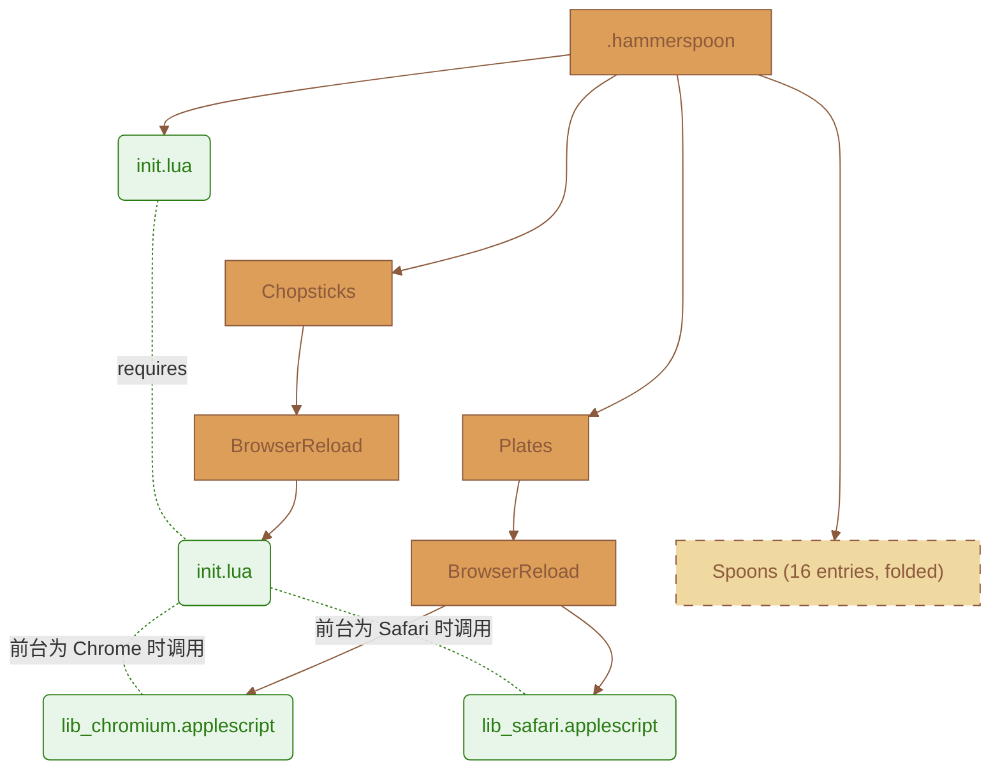

# .hammerspoon

## 摘要

`Chopsticks` is built on [Hammerspoon](https://www.hammerspoon.org/) and [Spoons](https://github.com/Hammerspoon/Spoons), using [Lua](https://www.lua.org/) and [AppleScript](https://developer.apple.com/library/archive/documentation/AppleScript/Conceptual/AppleScriptLangGuide/introduction/ASLR_intro.html) to build an extension framework for local secondary development.

- BrowserFocus **_浏览器聚焦模块_**
  - 一问多答, 同屏共版场景下, 一键聚焦 & 置顶窗口
- BrowserReload **_浏览器刷新模块_**
  - 一问多答, 同屏共版场景下, 可自定义同步刷新的标签页，让其他端点的实时信息一并加载, 一键刷新 & 置顶窗口
- EmmyLua
  - Thie plugin generates EmmyLua annotations for Hammerspoon and any installed Spoons
- Commander
  - This spoon lets execute commands from other spoon by a chooser
- HSKeybindings
  - Display Keybindings registered with bindHotkeys() and Spoons
- KSheet
  - Keybindings cheatsheet for current application
- MouseCircle
  - Draws a circle around the mouse pointer when a hotkey is pressed
- MouseFollowsFocus
  - Set the mouse pointer to the center of the focused window whenever focus changes
- InputSourceSwitch
  - Automatically switch the input source when switching applications
- ReloadConfiguration
  - Adds a hotkey to reload the hammerspoon configuration, and a pathwatcher to automatically reload on changes
- Seal
  - Pluggable launch bar
- SpeedMenu
  - Menubar netspeed meter
- TextClipboardHistory
  - Keep a history of the clipboard, only for text entries
- WifiNotifier
  - Receive notifications every time your wifi network changes
- WiFiTransitions
  - Allow arbitrary actions when transitioning between SSIDs
- WindowHalfsAndThirds
  - Simple window movement and resizing, focusing on half- and third-of-screen sizes
- WindowScreenLeftAndRight
  - Move windows to other screens

## 目录结构

| 路径          | 说明                                                                         |
| ------------- | ---------------------------------------------------------------------------- |
| `init.lua`    | 入口文件: 配置环境, 绑定快捷键, 注入 Spoons & Chopsticks                     |
| `Chopsticks/` | **_拓展_**:`BrowserReload` 存放 Lua 业务逻辑                                 |
| `Plates/`     | **_拓展_**:`BrowserReload` 存放 AppleScript 模板 (按浏览器核心类型拆成 2 份) |
| `Saucers/`    | **_拓展_**:`BrowserFocus` 存放 JaveScript 模板 (按标签类型拆成 N 份)         |
| `Spoons/`     | 自动下载, 管理所有第三方插件                                                 |

> [!NOTE]
>
> 参照 `Spoons` (勺子: 一体化), 扩展模块命名规则:
>
> - `Chopsticks` (筷子: 逻辑/控制)
> - `Plates` (盘子: 通信/应程)
> - `Saucers` (碟子: 载荷/微操)

## 拓扑图 (以 BrowserReload 为例)



> [!NOTE]
>
> init.lua 持有配置与热键并通过 andUse() 注入插件: 配置、编排、原语三层各自可以独立迭代，互不知晓对方细节, 三层分离:
>
> - `init.lua` 入口: 绑定触发键 和 配置站点标签
> - `Chopsticks/BrowserReload/init.lua` 纯 Lua 层: 检测环境, 识别默认浏览器, 生成匹配条件, 调用 AppleScript, 渲染模板
> - `Plates/BrowserReload/lib_*.applescript` 纯 AppleScript 层: 按浏览器引擎类型拆成 Chromium / Safari 2 份, 与 Lua 层解耦

## 拓扑图 (以 BrowserFocus 为例)

### 各层职责

| 层级   | 术语    | 技术栈      | 核心职责                             | 优势                                                           |
| :----- | :------ | :---------- | :----------------------------------- | :------------------------------------------------------------- |
| 控制层 | Host    | Lua         | 热键, 配置, 状态, 参数组装, 错误反馈 | 轻量常驻, 系统 API 丰富                                        |
| 桥接层 | Bridge  | AppleScript | 跨进程通信, 操控原生 GUI 和应用程序  | macOS 原生支持, 标准化控制 Applications                        |
| 执行层 | Payload | JavaScript  | 在网页上下文中实现元素级的精细控制   | 浏览器原生引擎, 避免一般 GUI 自动化 (如坐标 & 模拟点击) 的干扰 |

### 架构

| 特点       | 优势                                                                                                                                             |
| :--------- | :----------------------------------------------------------------------------------------------------------------------------------------------- |
| 健壮性     | 走 Application 内部事件总线, 免疫分辨率变化、弹窗、输入法等外部 GUI 干扰                                                                         |
| 低耦合     | 浏览器控制与网页操作分离，浏览器适配和页面适配可以独立维护                                                                                       |
| 关注点分离 | Lua 负责 "何时做 WHEN" 和 "调资源 WHERE" 和 "做什么 WHAT", AppleScript 负责 "找谁做 WHO" (特定应程), JavaScript 负责 "具体怎么做 HOW" (特定动作) |
| 可扩展性   | 不需要修改任何 Lua 或 AppleScript 或 JavaScript 逻辑代码，只需新增配置项, 符合开闭原则 (OCP)                                                     |
| 安全性     | 包裹错误处理机制                                                                                                                                 |

### 为何三层? (能力边界)

| 需求                 | Lua | AppleScript | JavaScript |
| :------------------- | :-: | :---------: | :--------: |
| 常驻: 后台全局热键   | ✅  |     ❌      |     ❌     |
| 查询: 默认浏览器是谁 | ✅  |     ❌      |     ❌     |
| 枚举/切换: 标签页面  | ❌  |     ✅      |     ❌     |
| 查询: 标签页面 URL   | ❌  |     ✅      | 仅自身页面 |
| 精细操作: DOM 元素   | ❌  |     ❌      |     ✅     |
| 交互: 处理反馈信息   | ✅  |     ✅      |     ✅     |

> [!NOTE]
>
> 没有任何单一语言能同时覆盖 "系统级热键监听 + 跨应用程序操控 + 页面内DOM微操" 这三个维度

### DSL Pipeline

```language-plain

             Configuration
                   │
                   ▼
         Hammerspoon / Lua
                   │
          ┌────────┴────────┐
          │                 │
      BrowserID           SiteID
          │                 │
          ▼                 ▼
    Browser Adapter    JSCode Adapter
          │                 │
          └────────┬────────┘
                   ▼
         Application / AppleScript
                   │
                   ▼
             Web DOM / JavaScript

```

## 已启用的 快捷键 与 模块

| 快捷键                  | 功能                                 | 模块                     |
| ----------------------- | ------------------------------------ | ------------------------ |
| `⌃ ⌥ ⌘ + J`             | 一键聚焦 沉浸式翻译 标签页面         | BrowserFocus             |
| `⌃ ⌥ ⌘ + K`             | 一键聚焦 AI 标签页面                 | BrowserFocus             |
| `⌃ ⌥ ⌘ + L`             | 批量刷新 AI 标签页面                 | BrowserReload            |
| `⌃ ⌥ ⌘ + '`             | 命令面板                             | Commander                |
| `⌃ ⌥ ⌘ + I / O`         | macOS 快捷键速查表 开关              | HSKeybindings            |
| `⌃ ⌥ ⌘ + P`             | Spoon 快捷键速查表 开关              | KSheet                   |
| `⌃ ⌥ ⌘ + M`             | 鼠标位置圈 激活                      | MouseCircle              |
| `⌃ ⌥ ⌘ + ;`             | Spotlight 式 应用 / 书签 启动器 开关 | Seal                     |
| `⌃ ⌥ ⌘ + U`             | 剪贴板历史 开关                      | TextClipboardHistory     |
| `⌃ ⌥ ⌘ + 7 / 9 / 3 / 1` | 左上 / 右上 / 右下 / 左下 四分之一屏 | WindowHalfsAndThirds     |
| `⌃ ⌥ ⌘ + A / W / D / S` | 左 / 上 / 右 / 下 三分之一屏         | WindowHalfsAndThirds     |
| `⌃ ⌥ ⌘ + 4 / 8 / 6 / 2` | 左 / 上 / 右 / 下 二分之一屏         | WindowHalfsAndThirds     |
| `⌃ ⌥ ⌘ + 5`             | 窗口居中                             | WindowHalfsAndThirds     |
| `⌃ ⌥ ⌘ + 0`             | 撤销窗口操作                         | WindowHalfsAndThirds     |
| `⌃ ⌥ ⌘ + ↑ / ↓`         | 窗口渐大 / 渐小                      | WindowHalfsAndThirds     |
| `⌃ ⌥ ⌘ + ← / →`         | 最大化开关 / 最大化激活              | WindowHalfsAndThirds     |
| `⌃ ⌥ ⌘ + [ / ]`         | 移动窗口跨 左 / 右 屏                | WindowScreenLeftAndRight |

## 系统级再一次拓展了快捷键

> [!NOTE]
>
> - 独立意义上, 系统级引入了 [Karabiner-Elements](https://karabiner-elements.pqrs.org/)
> - 可配置: 点击鼠标中键 -> `⌃ ⌥ ⌘ + J`
>   - 二者均可独立生效
>   - 二者无任何兼容性问题, 因为 `KE` 是在系统更底层监听了鼠标事件, 可跳转至 `HS` 的时间线

## BrowserReload 的配置方式

### 设计思想

- `sites` 是 "域名 =? 是否启用" 的映射
- `CHROMIUM_BROWSERS` 是 "浏览器 =? 是否启用" 的映射
- 用布尔开关代替增删条目，便于临时停用并保留 "曾支持" 记录
- Safari 单独分支, 无通用 `reload` 命令, 可用 "重设 URL" 方式触发

### 权限要求

- 首次触发时, macOS 系统会弹窗询问是否允许 `Hammerspoon` 控制目标浏览器, 需要在 **系统设置 → 隐私与安全性 → 自动化** 中勾选

### 具体条目

```lua
sites = {
    ["chatglm.cn/main/alltoolsdetail"] = true,
    ["chat.deepseek.com"]              = true,
    ["claude.ai"]                      = false,
    ["gemini.google.com/app"]          = false,
    ["www.google.com/search"]          = true,
    ["grok.com"]                       = false,
    ["www.kimi.com"]                   = true,
    ["www.qianwen.com"]                = false,
    ["chat.z.ai"]                      = true,
}
```

```lua
CHROMIUM_BROWSERS = {
    ["com.brave.Browser"]          = false,
    ["com.google.Chrome"]          = true,
    ["com.microsoft.edgemac"]      = true,
    ["com.vivaldi.Vivaldi"]        = false,
    ["company.thebrowser.Browser"] = false,
}
```

## Acknowledgments

- Thanks to the [Hammerspoon](https://github.com/Hammerspoon/hammerspoon) team for developing and maintaining this powerful automation tool
- The design philosophy of `Chopsticks` is inspired by the contribution examples from the [Spoons](https://github.com/Hammerspoon/Spoons) community volunteers

## Community

- [Code of Conduct](CODE_OF_CONDUCT.md)
- [Contributing Guide](CONTRIBUTING.md)
- [MIT License](LICENSE)
- [Security Policy](SECURITY.md)
